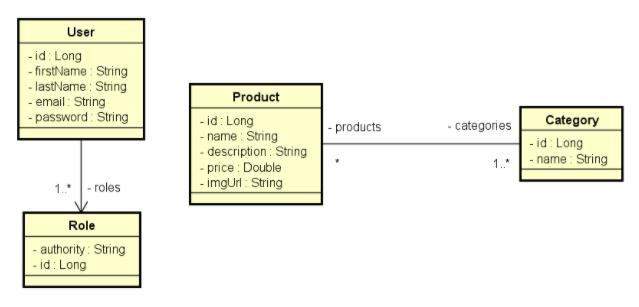

# 💻 Back end Dg Catalog
[](https://travis-ci.org/brandaogabriel/dgcatalog-bootcamp)

A api foi desenvolvida durante o bootcamp realizado na DevSuperior.

A implantação da api foi feita utilizando o heroku.

**Atenção**: Você precisa ter o java jdk 11 instalado na sua máquina bem como o `PATH_VARIABLE` do
java configurado e uma IDE de sua preferência.

## 🔌 Configurações para inicialização

- **O backend está setado em modo de PRODUÇÃO, acesse `src/main/resources/application.properties` e
  troque `spring.profiles.active=prod` por `spring.profiles.active=test`. Com essa mudança, será
  utilizado o banco de dados em memória (H2).**
- **O sistema utiliza o serviço da AWS de armazenamento de arquivos, S3, dessa forma é necessário
  que você crie um "bucket" bem como configure as credenciais que estão definidas em
  `main/resources/application.properties`.**
  ````
  aws.access_key_id=SUA_CHAVE_DE_ACESSO
  aws.secret_access_key=SUA_AWS_SECRET_KEY
  s3.bucket=NOME_DO_BUCKET
  s3.region=REGIAO_DO_BUCKET

Execute o comando: `mvn install` para instalar as dependências do maven.

Após baixar as dependências, execute a aplicação e a api estará rodando em http://localhost:8080.

Acesso ao banco de dados: `http://localhost:8080/h2-console`.

## 🗺️ Diagrama de Classes - Modelo de Domínio



## 🧾 Documentação

A documentação da api foi gerada através do Swagger e pode ser acessada
em `http://localhost:8080/swagger-ui.html#`

## 📌 Endpoints

Os seguintes endpoints estão configurados:

**ATENÇÃO:**

- `/h2-console`
- `/swagger-ui.html#`
- [GET] `/products`
- [GET]`/products/{id}`
- [GET] `/categories`
- [GET] `/categories/{id}`
- [POST] `/oauth/token`

Estão **liberadas** para acesso **sem autenticação**. Caso queira acessar as **demais** rotas é
necessário **realizar autenticação** no sistema.

### Auth

- `/oauth/token` - POST - Realiza o login do usuário na aplicação.

**OBS¹:** No momento de fazer a requisição, configure a "Authorizaiton" como `Basic Auth` e repasse
o `username=dgcatalog` e a `password=dgcatalog123`.

**OBS²:** O corpo da requisição deve ser do tipo `x-www-form-urlencoded`, crie os campos "username",
"password" e "grant_type".

- Em "username", coloque seu valor como `maria@gmail.com`.
- Em "password", coloque seu valor como `123456`.
- Em "grant_type", coloque seu valor como `password`. (Isso indica o método de autenticação do
  sistema).

**OBS³:** O usuário "maria" é super-usuário da aplicação, dessa forma tem acesso a todas as rotas.
Caso queira ver outros usuário veja o arquivo em `src/main/resources/data.sql`.

### Users

**APENAS ADMINISTRADORES PODEM ACESSAR AS ROTAS**

- `/users` - GET - Exibe todos os usuários paginados cadastrados na API em ordem alfabética (nome do
  usuário).
- `/users/{id}` - GET - Exibe as informações de um usuário específico bem como quais são suas
  "roles".
- `/users` - POST - Cria um usuário.
- `/users/{id}` - PUT - Atualiza as informações de um usuário específico.
- `/users/{id}` - DELETE - Remove um usuário específico.

**Exemplo de dados para criar um Usuário (JSON)**

```json
{
  "firstName": "any_name",
  "lastName": "any_lastName",
  "email": "any_email@gmail.com",
  "password": "any_password",
  "roles": [
    {
      "id": 1
    },
    {
      "id": 2
    }
  ]
}
```

**Exemplo de dados para atualizar um Usuário (JSON)**

```json
{
  "firstName": "any_name_edit",
  "lastName": "any_lastName_edit",
  "email": "any_email_edit@gmail.com",
  "roles": [
    {
      "id": 1
    }
  ]
}
```

### Products

- `/products` - GET - Exibe todos os produtos paginados cadastrados na API em ordem alfabética
  (nome do produto).
- `/products/{id}` - GET - Exibe as informações de um produto específico bem como quais são suas
  "categories".
- `/products` - POST - Cria um produto. **AUTENTICAÇÃO COMO OPERATOR OU ADMIN NECESSÁRIA**
- `/products/{id}` - PUT - Atualiza as informações de um produto específico. **AUTENTICAÇÃO COMO
  OPERATOR OU ADMIN NECESSÁRIA**
- `/products/{id}` - DELETE - Remove um produto específico. **AUTENTICAÇÃO COMO OPERATOR OU ADMIN
  NECESSÁRIA**
- `/products/image` - POST - Insere a imagem no AWS S3. É necessário que o corpo da requisição seja
  do tipo `form-data` com a chave `file`. **AUTENTICAÇÃO COMO OPERATOR OU ADMIN
  NECESSÁRIA**

**Exemplo de dados para criar um Produto (JSON)**

```json
{
  "date": "2020-01-14T15:00:00Z",
  "description": "any_description",
  "name": "any_name",
  "imgUrl": "",
  "price": 600.00,
  "categories": [
    {
      "id": 1
    },
    {
      "id": 3
    }
  ]
}
```

**Exemplo de dados para atualizar um Produto (JSON)**

```json
{
  "date": "2020-01-14T17:00:00Z",
  "description": "any_description_edit",
  "name": "any_name_Edit",
  "imgUrl": "",
  "price": 1000.00,
  "categories": [
    {
      "id": 2
    }
  ]
}
```

### Categories

- `/categories` - GET - Exibe todos as categorias paginadas cadastradas na API em ordem alfabética
  (nome da categoria).
- `/categories/{id}` - GET - Exibe as informações de uma categoria específica.
- `/categories` - POST - Cria uma categoria. **AUTENTICAÇÃO COMO OPERATOR OU ADMIN NECESSÁRIA**
- `/categories/{id}` - PUT - Atualiza as informações de uma categoria. **AUTENTICAÇÃO COMO OPERATOR
  OU ADMIN NECESSÁRIA**
- `/categories/{id}` - DELETE - Remove uma categoria específica. **AUTENTICAÇÃO COMO OPERATOR OU
  ADMIN NECESSÁRIA**

**Exemplo de dados para criar uma Categoria (JSON)**

```json
{
  "name": "any_name"
}
```

**Exemplo de dados para atualizar uma Categoria (JSON)**

```json
{
  "name": "any_name_edit"
}
```

## 🛠️ Ferramentas

1. Java
2. Springboot
3. Spring Data JPA
4. Spring Validation
5. Spring Cloud
6. Spring Security
7. Spring Security Oauth2
8. AWS Java JDK (Para utilizar o serviço S3)
8. Swagger (Documentação)
9. H2 database
10. postgresql

## 💾 Dados para povoar a api

Na pasta `src/main/resources` existe um arquivo **data.sql** com alguns dados já adicionados, para
inserir novos dados, basta incluí-los no arquivo. 